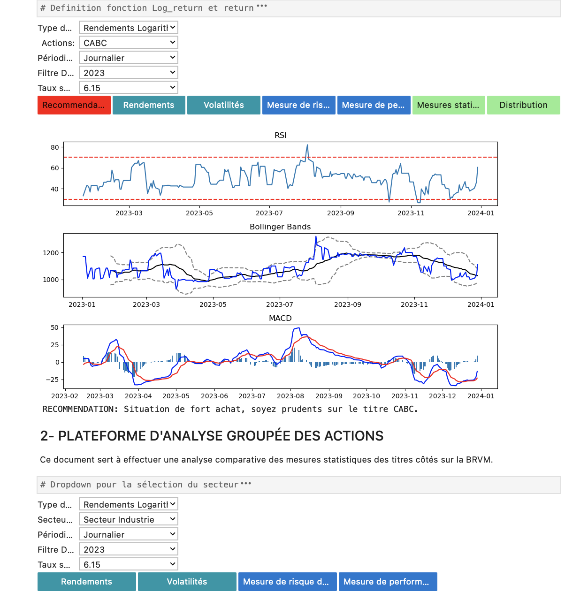

## Overview

This repository contains an interactive Jupyter Notebook designed to perform statistical analysis and risk measurement.             

**PLATEFORME MESURES STATISTIQUES-2.ipynb**   

*Statistical Metrics Platform*    

* Calculates annualized returns, volatility, Value at Risk (VaR), and Expected Shortfall.   
* Implements interactive widgets to allow user-driven analysis.   
* Provides data visualization of key statistical metrics.
* Uses RSI and MACD for investment decisions.

**edhec_risk_kit.py**  

*Risk Management Module provided by EDHEC*    

**Getting Started**

You will need to install from statsmodels, blpapi and ipywidgets pip using the following command:

* !pip install statsmodels    
* !pip install ipywidgets        

## User Interface Preview

Here’s what the platform looks like:

